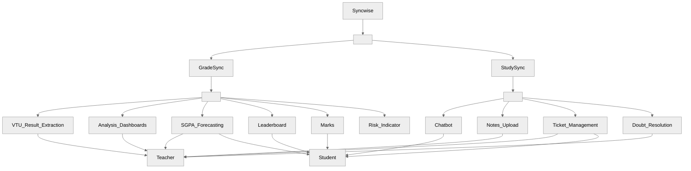

# Syncwise
Syncwise is an integrated education platform for VTU result analysis and extraction along with doubt and ticket managemnt.

```mermaid
%%{init: {'theme':'neutral'}}%%
graph TD;
  %% Main Project %%
  Syncwise -->|   | Intermediate1[ ]
  Intermediate1 -->|   | GradeSync
  Intermediate1 -->|   | StudySync

  %% GradeSync Submodules %%
  GradeSync -->|   | Intermediate2[ ]
  Intermediate2 -->|   | VTU_Result_Extraction
  Intermediate2 -->|   | Analysis_Dashboards
  Intermediate2 -->|   | SGPA_Forecasting
  Intermediate2 -->|   | Leaderboard
  Intermediate2 -->|   | Marks
  Intermediate2 -->|   | Risk_Indicator

  %% StudySync Submodules %%
  StudySync -->|   | Intermediate3[ ]
  Intermediate3 -->|   | Chatbot
  Intermediate3 -->|   | Notes_Upload
  Intermediate3 -->|   | Ticket_Management
  Intermediate3 -->|   | Doubt_Resolution

  %% Role Mappings for GradeSync %%
  VTU_Result_Extraction -->|   | Teacher
  Analysis_Dashboards -->|   | Teacher
  SGPA_Forecasting -->|   | Teacher
  SGPA_Forecasting -->|   | Student
  Leaderboard -->|   | Student
  Marks -->|   | Student

%% Role Mappings for StudySync %%
  Chatbot -->|   | Student
  Notes_Upload -->|   | Teacher
  Ticket_Management -->|   | Teacher
  Ticket_Management -->|   | Student
  Doubt_Resolution -->|   | Teacher

```
