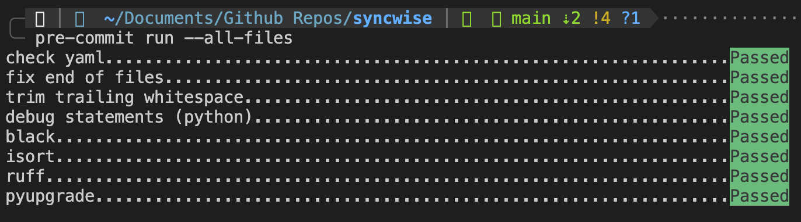
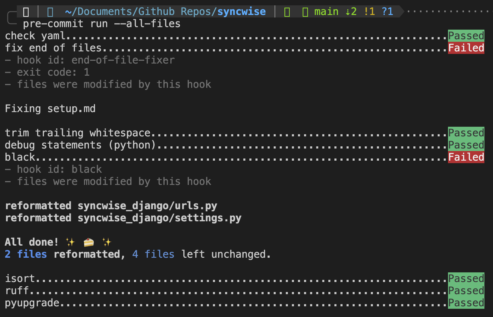

open terminal and execute:

1. make sure pre-commit is installed by executing the below command
`pre-commit install`
2. run docker-compose
`docker-compose up --build`
3. access the django-server
type `http://localhost:8050/` in browser.

> **NOTE:** Make sure you get all pre-commit tests passed after you commit, if not then make the changes and use `git add .` to add the modified files again and commit it. Refer to the below commit for succesful and failed pre-commits.
> 
> 
